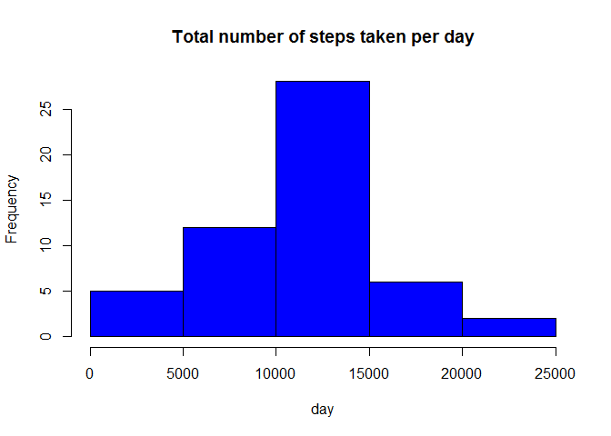
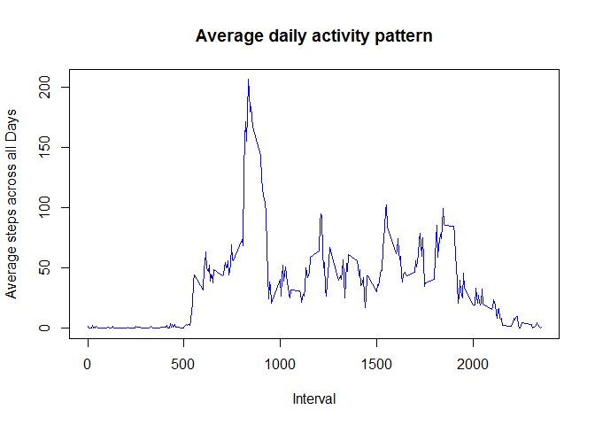
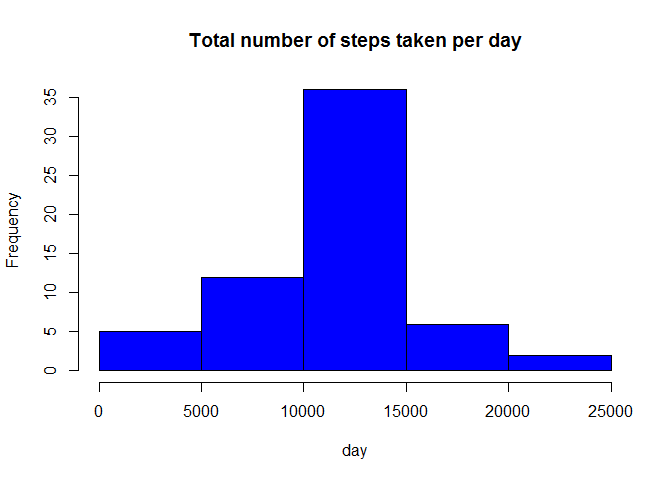

# Reproducible Research: Peer Assessment 1


## Loading and preprocessing the data

```r
setwd("C:/Users/pedew_000/RepData_PeerAssessment1/")
Activity_Monitoring <- read.csv(unz("activity.zip","activity.csv"), 
                                header = TRUE, 
                                sep =",",
                                colClasses = c("numeric", "character", "numeric"))
head(Activity_Monitoring)
```

```
##   steps       date interval
## 1    NA 2012-10-01        0
## 2    NA 2012-10-01        5
## 3    NA 2012-10-01       10
## 4    NA 2012-10-01       15
## 5    NA 2012-10-01       20
## 6    NA 2012-10-01       25
```

```r
names(Activity_Monitoring)
```

```
## [1] "steps"    "date"     "interval"
```
## What is mean total number of steps taken per day?

```r
Activity_Monitoring$date <- as.Date(Activity_Monitoring$date, "%Y-%m-%d")

TotalSteps <- aggregate(steps ~ date, data = Activity_Monitoring, sum, na.rm = TRUE)

head(TotalSteps)
```

```
##         date steps
## 1 2012-10-02   126
## 2 2012-10-03 11352
## 3 2012-10-04 12116
## 4 2012-10-05 13294
## 5 2012-10-06 15420
## 6 2012-10-07 11015
```

```r
hist(TotalSteps$steps, 
     main = "Total number of steps taken per day",
     xlab = "day", 
     col = "blue")
```

 

```r
mean_Total_Steps <- mean(TotalSteps$steps, na.rm=TRUE)
median_Total_Steps <- median(TotalSteps$steps, na.rm=TRUE)
```

The mean total number of steps taken per day is 1.0766189\times 10^{4} .
The median of the total number of steps taken per day is 1.0765\times 10^{4}r .

## What is the average daily activity pattern?

The interval variable is the 5 minute interval identifier. (x-axis).
The average numbers of steps taken across all days is the mean of the steps taken (y-axis).


```r
Time_Series_Average_Steps <- tapply(Activity_Monitoring$steps, Activity_Monitoring$interval, mean, na.rm = TRUE)

plot(row.names(Time_Series_Average_Steps),
     Time_Series_Average_Steps,
     type = "l",
     xlab = "Interval",
     ylab = "Average steps across all Days", main = "Average daily activity pattern",
     col = "blue")
```

 

```r
Max_Interval <- which.max(Time_Series_Average_Steps)
```

The 5-minute interval that contains the maximum of steps, on average across all days, is 835.

## Imputing missing values

```r
Missing_Values <- sum(is.na(Activity_Monitoring))

Missing_Value_Positions <- which(is.na(Activity_Monitoring$steps))

AverageSteps <- aggregate(steps ~ interval, data = Activity_Monitoring, FUN = mean)

Missing_Value_Fill <- numeric()
for (i in 1:nrow(Activity_Monitoring)) {
   Measurement <- Activity_Monitoring[i, ]
   if (is.na(Measurement$steps)) {
       steps <- subset(AverageSteps, interval == Measurement$interval)$steps
   } else {
     steps <- Measurement$steps
   }
   Missing_Value_Fill <- c(Missing_Value_Fill, steps)
}

New_Activity_Monitoring <- Activity_Monitoring
New_Activity_Monitoring$steps <- Missing_Value_Fill

New_Total_Steps <- aggregate(steps ~ date, data = New_Activity_Monitoring, sum, na.rm = TRUE)

hist(New_Total_Steps$steps, 
     main = "Total number of steps taken per day",
     xlab = "day", 
     col = "blue")
```

 

The total number of missing values is 2304.

The mean total number of steps taken per day is 1.0766189\times 10^{4} .
The median of the total number of steps taken per day is 1.0766189\times 10^{4}.

## Are there differences in activity patterns between weekdays and weekends?

```r
Day <- weekdays(New_Activity_Monitoring$date)

DayLevel <- vector()
for (i in 1:nrow(New_Activity_Monitoring)) {
    if (Day[i] == "Saturday") {
        DayLevel[i] <- "Weekend"
    } else if (Day[i] == "Sunday") {
        DayLevel[i] <- "Weekend"
    } else {
        DayLevel[i] <- "Weekday"
    }
}
New_Activity_Monitoring$DayLevel <- DayLevel
New_Activity_Monitoring$DayLevel <- factor(New_Activity_Monitoring$DayLevel)

StepsByDay <- aggregate(steps ~ interval + DayLevel, data = New_Activity_Monitoring, mean)
names(StepsByDay) <- c("interval", "daylevel", "steps")

library(lattice)

xyplot(steps ~ interval | daylevel, StepsByDay, type = "l", layout = c(1, 2), 
    xlab = "Interval", ylab = "Number of steps")
```

 
